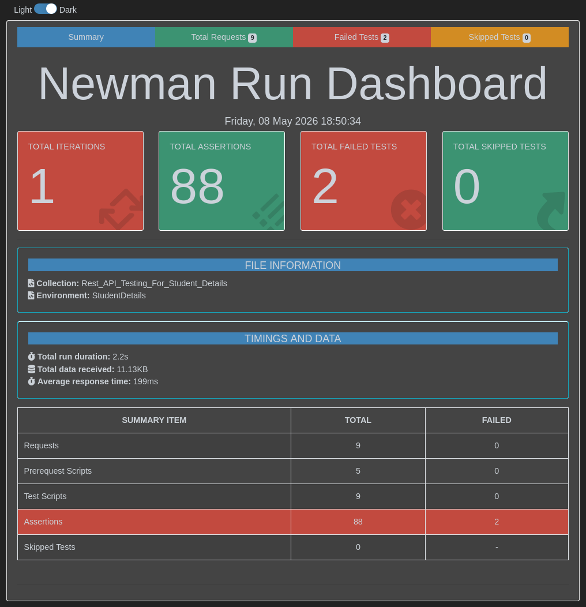

# 🚀 API Testing for Student Details


---

# 📌 Project Overview

This repository contains a complete **API Automation Testing Framework** developed for testing Student Details REST APIs using:

- Postman
- Newman
- JavaScript Assertions
- Dynamic Variables
- Environment Variables
- Automated HTML Reporting

The project demonstrates real-world API automation workflows including:

✅ CRUD API Testing  
✅ Dynamic Data Handling  
✅ Runtime Variable Injection  
✅ API Chaining  
✅ Response Validation  
✅ Automated Assertions  
✅ JSON Validation  
✅ Newman CLI Execution  
✅ HTML Dashboard Reporting  

---

# 🌐 API Base URL

```text
https://thetestingworldapi.com/api
```

---

# 🧪 Technologies Used

| Technology | Purpose |
|---|---|
| Postman | API Testing |
| Newman | Collection Automation |
| Newman HTML Extra | HTML Dashboard Reporting |
| JavaScript | Assertions & Scripting |
| JSON | Request & Response Handling |
| GitHub | Version Control |

---

# 📂 Repository Structure

```bash
API-Testing-for-Student-Details/
│
├── Collection/
│   └── Rest_API_Testing_For_Student_Details.postman_collection.json
│
├── Environment/
│   └── StudentDetails.postman_environment.json
│
├── newman/
│   └── Rest_API_Testing_For_Student_Details.html
│
├── assets/
│   └── Newman Summary Report.png
│
├── Newman Summary Report.pdf
│
├── report.html
│
└── README.md
```

---

# 🔥 Complete API Workflow

The collection performs a complete student lifecycle workflow.

```text
Get Student List
        ↓
Create Student
        ↓
Get Specific Student
        ↓
Update Student
        ↓
Create Technical Skills
        ↓
Create Student Address
        ↓
Get Final Student Details
        ↓
Delete Student
```

---

# 🚀 API Modules

---

# ✅ 1. Get Student List

Retrieves all available student records.

## Validations

- Response code validation
- Response time validation
- Response size validation
- JSON response validation

---

# ✅ 2. Create Student

Creates a new student dynamically using runtime-generated data.

## Dynamic Data Used

- Random first name
- Random middle name
- Random last name
- Dynamic date of birth

---

## 🔥 Dynamic Variable Script

```javascript
var first_name = pm.variables.replaceIn('{{$randomNamePrefix}}');
pm.environment.set("first_name", first_name);

var middle_name = pm.variables.replaceIn('{{$randomFirstName}}');
pm.environment.set("middle_name", middle_name);

var last_name = pm.variables.replaceIn('{{$randomLastName}}');
pm.environment.set("last_name", last_name);

var date_of_birth = require('moment')().format('DD-MM-YYYY');
pm.environment.set("date_of_birth", date_of_birth);
```

---

## Example Request Body

```json
{
    "first_name": "{{first_name}}",

    "middle_name": "{{middle_name}}",

    "last_name": "{{last_name}}",

    "date_of_birth": "{{date_of_birth}}"
}
```

---

# ✅ 3. Get Specific Student

Retrieves a specific student dynamically using stored student ID.

## Validations

- Response code validation
- Student information validation
- JSON validation
- Status validation

---

## Example Assertion

```javascript
pm.test("Verify the response code 200 or Not", function () {
    pm.expect(pm.response.code).to.eql(200);
});
```

---

# ✅ 4. Update Student

Updates previously created student information dynamically.

## Features

- Runtime data update
- Environment variable reuse
- Response validation

---

# ✅ 5. Create Technical Skills

Creates technical skill information dynamically.

## Features

✅ Dynamic Programming Languages  
✅ Runtime Experience Generation  
✅ Random Integer Generation  
✅ Environment Variable Injection  

---

## Dynamic Skill Script

```javascript
var skills = [
    "Java",
    "Python",
    "C++",
    "JavaScript",
    "Go"
];

var lang1 = skills[Math.floor(Math.random() * skills.length)];
var lang2 = skills[Math.floor(Math.random() * skills.length)];

pm.environment.set("lang1", lang1);
pm.environment.set("lang2", lang2);
```

---

# ✅ 6. Create Student Address

Creates dynamic permanent address information.

## Features

- Dynamic city generation
- Dynamic country generation
- Dynamic phone numbers
- UUID generation

---

## Example Address Request Body

```json
{
    "Permanent_Address": {

        "House_Number": "{{house_number}}",

        "City": "{{city}}",

        "State": "{{state}}",

        "Country": "{{country}}",

        "PhoneNumber": [

            {
                "Std_Code": "{{std_code1}}",

                "Home": "{{home1}}",

                "Mobile": "{{mobile1}}"
            },

            {
                "Std_Code": "{{std_code2}}",

                "Home": "{{home2}}",

                "Mobile": "{{mobile2}}"
            }
        ]
    },

    "stId": "{{stId}}"
}
```

---

# ✅ 7. Final Student Details Verification

Validates final combined student information after all API operations.

This ensures:
- Student creation succeeded
- Technical skills linked properly
- Address information stored correctly

---

# ✅ 8. Delete Student

Deletes the dynamically created student.

## Validations

- Delete response validation
- Status code verification
- Resource deletion confirmation

---

# 🧠 Dynamic Variables Used

This project heavily uses Postman Dynamic Variables to simulate real-world runtime testing.

| Variable | Purpose |
|---|---|
| `{{$randomFirstName}}` | Random first name |
| `{{$randomLastName}}` | Random surname |
| `{{$randomCity}}` | Dynamic city |
| `{{$randomCountry}}` | Dynamic country |
| `{{$randomPhoneNumber}}` | Dynamic phone number |
| `{{$randomUUID}}` | Unique identifier |
| `{{$randomInt}}` | Random integer |

---

# 🔥 Assertions Implemented

The framework includes comprehensive validations:

✅ HTTP Status Code Validation  
✅ Response Time Validation  
✅ Response Size Validation  
✅ JSON Validation  
✅ Dynamic Data Matching  
✅ API Business Logic Validation  
✅ Environment Variable Validation  

---

## Example Assertions

### Status Code Validation

```javascript
pm.expect(pm.response.code).to.eql(200);
```

---

### Response Time Validation

```javascript
pm.expect(pm.response.responseTime).to.be.below(3000);
```

---

### JSON Validation

```javascript
pm.response.to.be.json;
```

---

### Dynamic Data Validation

```javascript
pm.expect(pm.environment.get("first_name"))
.to.eql(responseBody.data.first_name);
```

---

# 📊 Newman HTML Dashboard Report

The project generates a professional Newman HTML dashboard report after execution.

---

## 📈 Report Summary

| Metric | Result |
|---|---|
| Total Requests | 8 |
| Total Assertions | 82 |
| Failed Tests | 2 |
| Skipped Tests | 0 |
| Average Response Time | 175ms |

---

# 📸 Newman Dashboard Preview



---

# 🌐 Live Newman HTML Report

## 🔗 View Live Report

https://mostafizur-zahid.github.io/API-Testing-for-Student-Details/report.html

---

# ▶️ Run Collection Using Newman

---

# ✅ Install Newman

```bash
npm install -g newman
```

---

# ✅ Install HTML Reporter

```bash
npm install -g newman-reporter-htmlextra
```

---

# ✅ Run Collection

```bash
newman run Rest_API_Testing_For_Student_Details.postman_collection.json \
-e StudentDetails.postman_environment.json \
-r htmlextra
```

---

# 📁 Environment Variables

Environment variables are used for:

- Runtime data storage
- API chaining
- Dynamic validations
- Reusable execution flow

---

## Example Variables

```text
base_url
id
first_name
middle_name
last_name
date_of_birth
lang1
lang2
city
country
house_number
stId
```

---

# 🎯 Key Learning Outcomes

This project demonstrates practical experience with:

✅ REST API Automation  
✅ Postman Scripting  
✅ Dynamic Runtime Variables  
✅ Newman CLI Automation  
✅ JSON Validation  
✅ API Chaining  
✅ Environment Management  
✅ Automated HTML Reporting  
✅ Runtime Assertions  
✅ Professional API Workflow Testing  

---

# 🔥 Project Highlights

✅ Real-world API automation workflow  
✅ Runtime-generated testing data  
✅ Dynamic environment variable injection  
✅ End-to-end API lifecycle testing  
✅ Professional Newman HTML dashboard  
✅ Structured automation architecture  
✅ Portfolio-ready project design  

---

# 👨‍💻 Author

## Md. Mostafizur Rahman Zahid 

🎓 CSE Graduate  
🔐 Aspiring Security Engineer  
🧪 SQA & API Automation Enthusiast  
⚡ Cybersecurity & DevSecOps Learner  

---

# 🔗 LinkedIn

https://www.linkedin.com/in/mostafizur-zahid/

---

# ⭐ GitHub Repository

https://github.com/mostafizur-zahid/API-Testing-for-Student-Details

---
